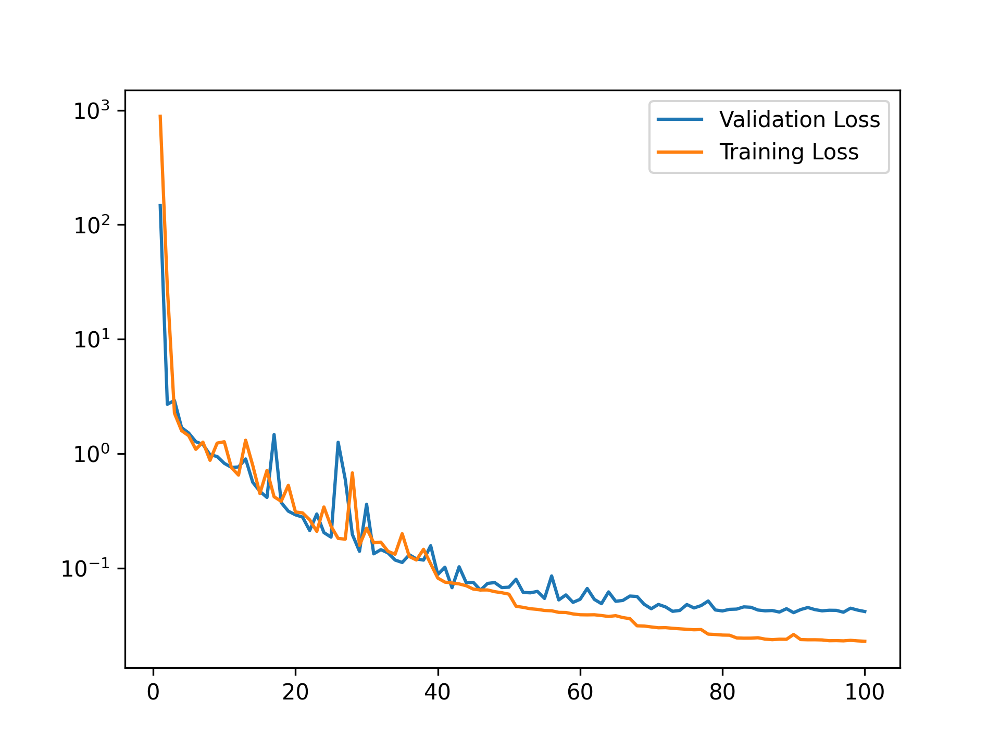
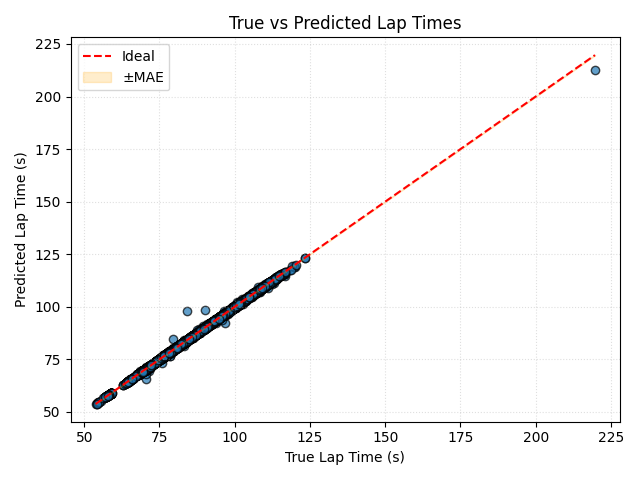

# f1-lap-prediction
*End-to-end GRU-based lap time prediction from real F1 telemetry & weather data.*


Predict F1 lap time from on-car telemetry + weather, using a GRU regression model.  
Central goal: **predict lap time to within ~0.1s** on unseen laps — best run achieved **0.15s MAE**.  
Also included: a simple **error-weighted feature “influence” heatmap** (see the [caveat on the heatmap](#caveat-on-the-heatmap) below).

---

## Table of contents
- [Quickstart](#quickstart)
- [Why this project?](#why-this-project)
- [Repo structure](#repo-structure)
- [Pipeline overview](#pipeline-overview-plain-english)
- [Usage examples](#usage-examples)
- [My results](#my-results)
  - [Best-run metrics](#best-run-metrics)
  - [Metrics explained](#metrics-explained)
  - [Best-run plots](#best-run-plots)
  - [Caveat on the heatmap](#caveat-on-the-heatmap)
- [Reproducibility](#reproducibility)
- [Troubleshooting](#troubleshooting)
- [Acknowledgments](#acknowledgments)
- [License](#license)

---

## Quickstart

Works on CPU — training takes ~ 4 hours; GPU optional.

```bash
# 1) Create & activate a virtual environment (example: venv)
python -m venv .venv
# Windows:
.venv\Scripts\activate
# macOS/Linux:
source .venv/bin/activate

# 2) Install deps
pip install -r requirements.txt
# (GPU users: install the torch wheel matching your CUDA first, then the rest.)

# 3) Run the full pipeline
python src/cleaning.py     # pulls telemetry via FastF1, builds raw/processed data
python src/dataset.py      # builds preprocessed matrices for train/val/test
python src/model.py        # trains GRU, saves to models/<timestamp>/
python src/evaluate.py --latest   # or: --model "<timestamp>"
```

- The first run will populate `data/fastf1cache/` automatically.
- All generated artifacts live under `data/` and `models/` (both git-ignored).

---

## Why this project?

- A compact, reproducible baseline for **sequence regression** on real F1 telemetry.
- Clear, end-to-end pipeline (API → cleaned →  preprocessed → model → evaluation).
- Lightweight enough to run **on CPU**; GPU is optional.

---

## Repo structure

```
src/
  cleaning.py      # FastF1 ingestion; weather merge; encode categoricals; resample laps; save metadata/raw/processed
  dataset.py       # Build preprocessed tensors + splits; expand one-hots; save metadata/preprocessed
  model.py         # GRURegressor + training loop; checkpoints; plots
  evaluate.py      # Metrics (MAE/RMSE/R²/MAPE), per-lap errors, error-weighted feature heatmap

data/
  fastf1cache/     # (auto) FastF1 HTTP cache
  raw/             # Per-driver lap cubes: L x T x F_raw
  processed/       # Per-driver lap summary JSONs
  preprocessed/    # Per-lap model-ready arrays split by train/val/test
  metadata/        # Encoders, normalization stats, bookkeeping files

models/
  <timestamp>/
    model_info.json             # Model Configurations; e.g. initial_learning_rate, num_epochs, batch_size
    model_state_dict.pth        # Model parameters
    validation_loss_plot.png    # Training and validation loss over epochs
    evaluation/                 # evaluate.py output
      metrics.json              
      per_lap_errors.json       
      graphs/
        true_vs_pred.png 
        error_heatmap.png

notebooks/
  example_data/        # Tiny, *insignificant* sample files copied for illustration (example_metadata/raw/processed/preprocessed)
  example_model/       # My best model; not trained on a determined seed
```

> **Note:** **No real data is bundled.** Scripts create everything locally. `notebooks/example_data/` only holds tiny, illustrative samples.

---

## Pipeline overview (plain English)

1. **`cleaning.py`**  
   - Loads a season’s schedule and sessions via **FastF1**.  
   - Pulls per-lap telemetry and merges with weather (nearest-asof, 60s tolerance).  
   - Adds lap metadata, **encodes categoricals** into integer IDs (global encoders), and **resamples each lap by distance** to a fixed number of steps (150).
   - Saves:
     - **raw cubes** (`data/raw/.../*.npy`): Lap stacks per driver
     - **per-lap summaries** (`data/processed/.../*.json`)
     - **encoders** & **cleaned session bookkeeping** (`data/metadata/...`)

2. **`dataset.py`**  
   - Normalizes numerical data via **normalization_stats**
   - Expands integer-encoded categoricals to **one-hot vectors**.
   - Builds model-ready **train/val/test** arrays and **feature name list**.
   - Saves **preprocessed** arrays under `data/preprocessed/`.

3. **`model.py`**  
   - Defines **`GRURegressor`** and the training loop (seeded for reproducibility).  
   - Saves the **model** and its **configurations** along with simple **training curves** to `models/<timestamp>/`.

4. **`evaluate.py`**  
   - Loads a saved model and the test set.  
   - Computes **MAE, RMSE, R², MAPE**, plus **per-lap error breakdown**.  
   - Produces two plots:
     - **True vs. Predicted** scatter with ±MAE band.  
     - **Error-weighted feature heatmap** (see [Caveat](#caveat-on-the-heatmap) below).  
   - Write-out to `models/<timestamp>/evaluation/`.

---

## Usage examples

Evaluate latest trained/modified model:
```bash
python src/evaluate.py --latest
```

Evaluate a specific run:
```bash
python src/evaluate.py --model "Aug-05-2025@0154"
```

Regenerate everything from scratch (will rebuild encoders and stats as needed):
```bash
python src/cleaning.py
python src/dataset.py
python src/model.py
python src/evaluate.py --latest
```
> **Note:** Ensure that you evaluate a model **before** training a new one. For now, a model's configurations are **only** stored for **bookkeeping**, and are **not** loaded in for evaluate.py. If you train a **new** model on **new** configurations, you will have to **manually** change the global variables of **evaluate.py** back to the **old** configurations before evaluating the **old** model.

---

## Requirements

See `requirements.txt`. Works on CPU. For GPU:
- Install the **PyTorch** wheel matching your CUDA version first (from pytorch.org),
- then `pip install -r requirements.txt`.

> **Note:** Training was developed and tested on **CPU**. Set `num_workers=0` if you hit dataloader spawn issues on Windows/Notebooks.

---

## My results

### Best-run metrics

| Metric | Value
|---|---
| **MAE** (Mean Absolute Error) | `0.15 s`
| **RMSE** (Root Mean Squared Error) | `0.29 s`
| **R²** (Coefficient of Determination) | `0.9994`
| **MAPE** (Mean Absolute Percentage Error) | `0.17%`

<sub>Source JSON: [`notebooks/example_model/evaluation/metrics.json`](notebooks/example_model/evaluation/metrics.json). See also [Metrics explained](#metrics-explained).</sub>

### Metrics Explained

- **MAE (Mean Absolute Error)** — Average absolute difference between predicted and actual lap times *(in seconds)*.  
  > Here: `0.15s` → on average, predictions are within **0.15** seconds of the true lap time.

- **RMSE (Root Mean Squared Error)** — Square root of the mean of squared errors. Penalizes large errors more heavily than MAE.  
  > Here: `0.29s` → most prediction errors are below ~**0.3** seconds, with larger misses weighted more in the score.

- **R² (Coefficient of Determination)** — Proportion of variance in lap times explained by the model (1.0 = perfect fit).  
  > Here: `0.9994` → the model explains **99.94%** of lap time variation.

- **MAPE (Mean Absolute Percentage Error)** — Average absolute error as a percentage of the actual lap time.  
  > Here: `0.17%` → predictions are typically within **0.17%** of the true lap time.

### Best-run plots

<p align="center">
  <figure style="display:inline-block;margin:8px;">
    
    <figcaption><i>Figure 1:</i> Training & validation loss over epochs.</figcaption>
  </figure>
  <figure style="display:inline-block;margin:8px;">
    
    <figcaption><i>Figure 2:</i> True vs Predicted lap times (±MAE band).</figcaption>
  </figure>
  <figure style="display:inline-block;margin:8px;">
    
    <figcaption><i>Figure 3:</i> Error-weighted feature heatmap (see <a href="#caveat-on-the-heatmap">caveat</a>).</figcaption>
  </figure>
</p>

### Caveat on the heatmap:

> **Note:** it’s designed for **continuous and discrete targets** and shows **absolute contribution to error** (|input| × |prediction error|). It is **not** a causal attribution method and should be read as a rough, error-weighted saliency map, best for features that are **only** 0 **or** 1 (those that have been one-hot encoded).

---

## Reproducibility

- Seeds are set for PyTorch/NumPy in training code.  
- Feature dimensionality is **derived from saved encoders** at eval time (no hard-coded `INPUT_SIZE`).  
- Data and model artifacts are **not** committed; see `.gitignore`.

---

## Troubleshooting

- **FastF1 rate limiting / empty telemetry**: the script skips empty laps and pauses briefly between sessions. Re-run cleaning.py if needed; cleaned data is saved and skipped over on reruns (I had to rerun at least 3 times).  
- **Encoder mismatches**: delete `data/metadata/global_encoders.json` and regenerate via `cleaning.py`.  
- **Windows dataloader errors**: set `num_workers=0`.

---

## Acknowledgments

- Built on top of the excellent **FastF1** library.  
- Some drafting and refactoring assistance provided by an AI code assistant.

---

## License

MIT — see [`LICENSE`](LICENSE).  

You’re free to use, modify, and distribute with attribution and warranty disclaimer as per the MIT terms.
